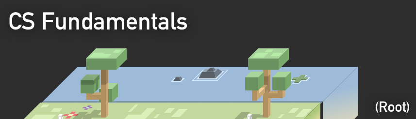

  

<h1 align="center">
	:earth_americas: Fundamentals
</h1>

<h3 align="center">
	A Learning Repository
</h3>

:milky_way: A collection of topics regarding the fundamentals of programming & computer science.

----

## :scroll: Algorithms

* [Algorithms](https://github.com/markwindsorr/CSFundamentals/tree/master/Algorithms)

----

## :statue_of_liberty: Data Structures

* [Data Structures](https://github.com/markwindsorr/CSFundamentals/tree/master/Data%20Structures)

----

## :pencil2: Practice Questions

* [Fortran Problems](https://github.com/markwindsorr/CSFundamentals/tree/master/Problems/Fortran%20Problems)
* [Swift Problems](https://github.com/markwindsorr/CSFundamentals/tree/master/Problems/Swift%20Problems)
* [Python Problems](https://github.com/markwindsorr/CSFundamentals/tree/master/Problems/Python%20Problems)
* [SQL Problems](https://github.com/markwindsorr/CSFundamentals/tree/master/Problems/SQL%20Problems)

